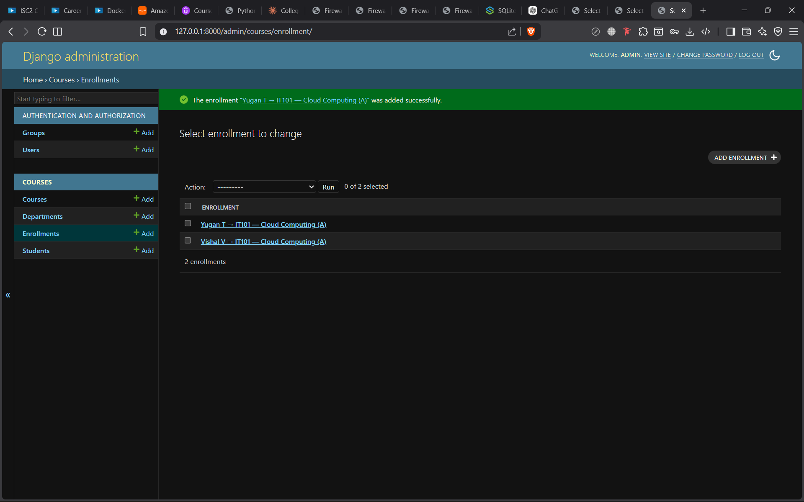
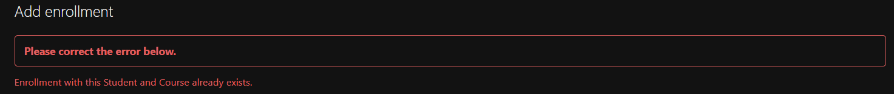
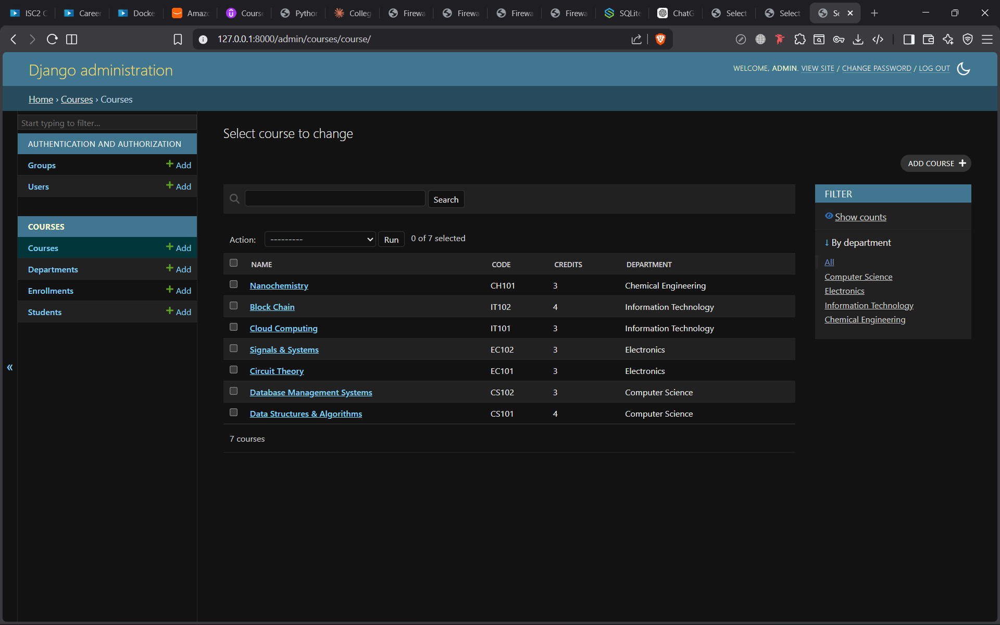
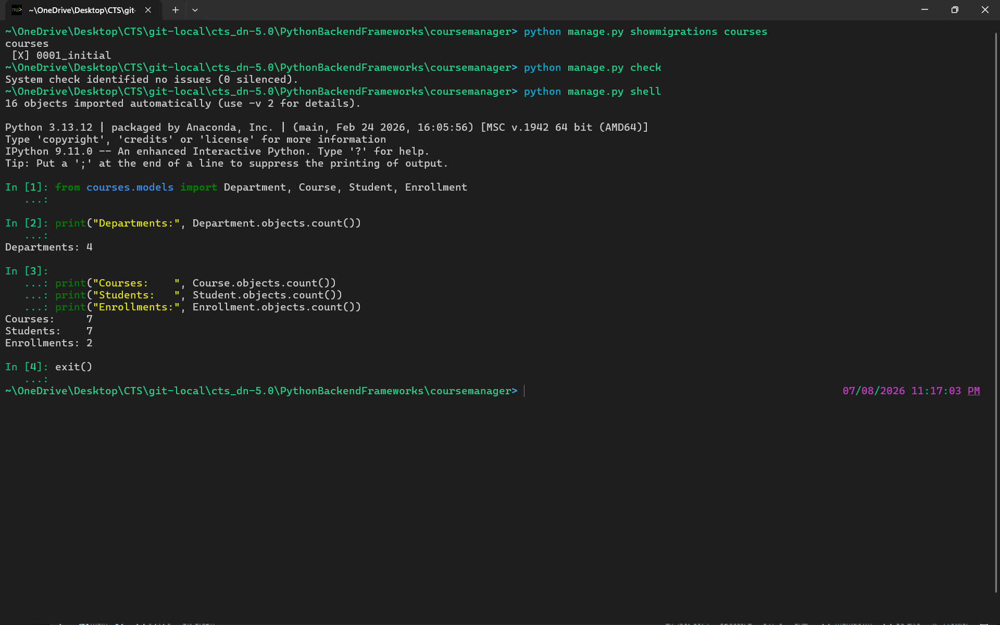

# Task 1: Define the models 

## Changed the models in `courses/models.py`

### Then migrate it

```bash 
python manage.py makemigrations
```

~\OneDrive\Desktop\CTS\git-local\cts_dn-5.0\PythonBackendFrameworks\coursemanager> python manage.py makemigrations
Migrations for 'courses':
  courses\migrations\0001_initial.py
    + Create model Department
    + Create model Course
    + Create model Student
    + Create model Enrollment
~\OneDrive\Desktop\CTS\git-local\cts_dn-5.0\PythonBackendFrameworks\coursemanager> 

### To view all the migrations 

```bash 
python manage.py showmigrations 
```


~\OneDrive\Desktop\CTS\git-local\cts_dn-5.0\PythonBackendFrameworks\coursemanager> python manage.py showmigrations
admin
 [X] 0001_initial
 [X] 0002_logentry_remove_auto_add
 [X] 0003_logentry_add_action_flag_choices
auth
 [X] 0001_initial
 [X] 0002_alter_permission_name_max_length
 [X] 0003_alter_user_email_max_length
 [X] 0004_alter_user_username_opts
 [X] 0005_alter_user_last_login_null
 [X] 0006_require_contenttypes_0002
 [X] 0007_alter_validators_add_error_messages
 [X] 0008_alter_user_username_max_length
 [X] 0009_alter_user_last_name_max_length
 [X] 0010_alter_group_name_max_length
 [X] 0011_update_proxy_permissions
 [X] 0012_alter_user_first_name_max_length
contenttypes
 [X] 0001_initial
 [X] 0002_remove_content_type_name
courses
 [ ] 0001_initial
sessions
 [X] 0001_initial
~\OneDrive\Desktop\CTS\git-local\cts_dn-5.0\PythonBackendFrameworks\coursemanager>  

### Apply the migrations to the database

```bash 
python manage.py migrate
```

~\OneDrive\Desktop\CTS\git-local\cts_dn-5.0\PythonBackendFrameworks\coursemanager> python manage.py migrate
Operations to perform:
  Apply all migrations: admin, auth, contenttypes, courses, sessions
Running migrations:
  Applying courses.0001_initial... OK
~\OneDrive\Desktop\CTS\git-local\cts_dn-5.0\PythonBackendFrameworks\coursemanager>   

### To verify the db 
Use predefined python script

```bash 
python manage.py dbshell
``` 

~\OneDrive\Desktop\CTS\git-local\cts_dn-5.0\PythonBackendFrameworks\coursemanager> python manage.py dbshell
SQLite version 3.51.1 2025-11-28 17:28:25
Enter ".help" for usage hints.
sqlite> .tables
auth_group                  courses_department
auth_group_permissions      courses_enrollment
auth_permission             courses_student
auth_user                   django_admin_log
auth_user_groups            django_content_type
auth_user_user_permissions  django_migrations
courses_course              django_session
sqlite> .schema courses_enrollment
CREATE TABLE IF NOT EXISTS "courses_enrollment" ("id" integer NOT NULL PRIMARY KEY AUTOINCREMENT, "enrollment_date" date NOT NULL, "grade" varchar(2) NULL, "course_id" bigint NOT NULL REFERENCES "courses_course" ("id") DEFERRABLE INITIALLY DEFERRED, "student_id" bigint NOT NULL REFERENCES "courses_student" ("id") DEFERRABLE INITIALLY DEFERRED);
CREATE UNIQUE INDEX "courses_enrollment_student_id_course_id_2d19b567_uniq" ON "courses_enrollment" ("student_id", "course_id");
CREATE INDEX "courses_enrollment_course_id_2631503e" ON "courses_enrollment" ("course_id");
CREATE INDEX "courses_enrollment_student_id_aebf8536" ON "courses_enrollment" ("student_id");
sqlite> SELECT * FROM courses_enrollment;
sqlite> .quit
~\OneDrive\Desktop\CTS\git-local\cts_dn-5.0\PythonBackendFrameworks\coursemanager>  

# Task 2: Test the models

### To open the shell and test the models

```bash 
python manage.py shell
``` 

~\OneDrive\Desktop\CTS\git-local\cts_dn-5.0\PythonBackendFrameworks\coursemanager> python manage.py shell
16 objects imported automatically (use -v 2 for details).

Python 3.13.12 | packaged by Anaconda, Inc. | (main, Feb 24 2026, 16:05:56) [MSC v.1942 64 bit (AMD64)]
Type 'copyright', 'credits' or 'license' for more information
IPython 9.11.0 -- An enhanced Interactive Python. Type '?' for help.
Tip: Use `%timeit` or `%%timeit`, and the  `-r`, `-n`, and `-o` options to easily profile your code.

In [1]: from courses.models import Department, Course, Student, Enrollment
   ...:

In [2]: cs   = Department.objects.create(name='Computer Science', head_of_dept='Dr. Rubesh', budget=850000)
   ...: ec   = Department.objects.create(name='Electronics',      head_of_dept='Dr. Priya ',   budget=620000)

In [3]: c1 = Course.objects.create(name='Data Structures & Algorithms', code='CS101', credits=4, department=cs)
   ...: c2 = Course.objects.create(name='Database Management Systems',  code='CS102', credits=3, department=cs)
   ...: c3 = Course.objects.create(name='Circuit Theory',               code='EC101', credits=3, department=ec)
   ...: c4 = Course.objects.create(name='Signals & Systems',            code='EC102', credits=3, department=ec)

In [4]: s1 = Student.objects.create(first_name='Arjun',  last_name='Mehta',  email='arjun@college.edu',  department=cs,
      ⋮  enrollment_year=2022)
   ...: s2 = Student.objects.create(first_name='Priya',  last_name='Suresh', email='priya@college.edu',  department=cs,
      ⋮  enrollment_year=2022)
   ...: s3 = Student.objects.create(first_name='Rohan',  last_name='Verma',  email='rohan@college.edu',  department=ec,
      ⋮  enrollment_year=2021)
   ...: s4 = Student.objects.create(first_name='Sneha',  last_name='Patel',  email='sneha@college.edu',  department=ec,
      ⋮  enrollment_year=2023)
   ...: s5 = Student.objects.create(first_name='Vikram', last_name='Das',    email='vikram@college.edu', department=cs,
      ⋮  enrollment_year=2022)

In [5]: print("Created:", Department.objects.count(), "depts,",
   ...:       Course.objects.count(), "courses,",
   ...:       Student.objects.count(), "students")
Created: 2 depts, 4 courses, 5 students

In [6]: cs_courses = Course.objects.filter(department__name='Computer Science')
   ...:
   ...: for course in cs_courses:
   ...:     print(course)
   ...:
CS101 — Data Structures & Algorithms
CS102 — Database Management Systems

In [7]: from django.db.models import Count

In [8]: dept_counts = Department.objects.annotate(course_count=Count('course'))
   ...:
   ...: for dept in dept_counts:
   ...:     print(f"{dept.name}: {dept.course_count} courses")
   ...:
---------------------------------------------------------------------------
FieldError                                Traceback (most recent call last)
Cell In[8], line 1
----> 1 dept_counts = Department.objects.annotate(course_count=Count('course'))
      3 for dept in dept_counts:
      4     print(f"{dept.name}: {dept.course_count} courses")

File ~\miniconda3\Lib\site-packages\django\db\models\manager.py:87, in BaseManager._get_queryset_methods.<locals>.create_method.<locals>.manager_method(self, *args, **kwargs)
     85 @wraps(method)
     86 def manager_method(self, *args, **kwargs):
---> 87     return getattr(self.get_queryset(), name)(*args, **kwargs)

File ~\miniconda3\Lib\site-packages\django\db\models\query.py:1699, in QuerySet.annotate(self, *args, **kwargs)
   1694 """
   1695 Return a query set in which the returned objects have been annotated
   1696 with extra data or aggregations.
   1697 """
   1698 self._not_support_combined_queries("annotate")
-> 1699 return self._annotate(args, kwargs, select=True)

File ~\miniconda3\Lib\site-packages\django\db\models\query.py:1751, in QuerySet._annotate(self, args, kwargs, select)
   1749         clone.query.add_filtered_relation(annotation, alias)
   1750     else:
-> 1751         clone.query.add_annotation(
   1752             annotation,
   1753             alias,
   1754             select=select,
   1755         )
   1756 for alias, annotation in clone.query.annotations.items():
   1757     if alias in annotations and annotation.contains_aggregate:

File ~\miniconda3\Lib\site-packages\django\db\models\sql\query.py:1247, in Query.add_annotation(self, annotation, alias, select)
   1245 """Add a single annotation expression to the Query."""
   1246 self.check_alias(alias)
-> 1247 annotation = annotation.resolve_expression(self, allow_joins=True, reuse=None)
   1248 if select:
   1249     self.append_annotation_mask([alias])

File ~\miniconda3\Lib\site-packages\django\db\models\aggregates.py:261, in Count.resolve_expression(self, *args, **kwargs)
    260 def resolve_expression(self, *args, **kwargs):
--> 261     result = super().resolve_expression(*args, **kwargs)
    262     source_expressions = result.get_source_expressions()
    264     # In case of composite primary keys, count the first column.

File ~\miniconda3\Lib\site-packages\django\db\models\aggregates.py:122, in Aggregate.resolve_expression(self, query, allow_joins, reuse, summarize, for_save)
    118 def resolve_expression(
    119     self, query=None, allow_joins=True, reuse=None, summarize=False, for_save=False
    120 ):
    121     # Aggregates are not allowed in UPDATE queries, so ignore for_save
--> 122     c = super().resolve_expression(query, allow_joins, reuse, summarize)
    123     if summarize:
    124         # Summarized aggregates cannot refer to summarized aggregates.
    125         for ref in c.get_refs():

File ~\miniconda3\Lib\site-packages\django\db\models\expressions.py:301, in BaseExpression.resolve_expression(self, query, allow_joins, reuse, summarize, for_save)
    297 c = self.copy()
    298 c.is_summary = summarize
    299 source_expressions = [
    300     (
--> 301         expr.resolve_expression(query, allow_joins, reuse, summarize, for_save)
    302         if expr is not None
    303         else None
    304     )
    305     for expr in c.get_source_expressions()
    306 ]
    307 if not self.allows_composite_expressions and any(
    308     isinstance(expr, ColPairs) for expr in source_expressions
    309 ):
    310     raise ValueError(
    311         f"{self.__class__.__name__} expression does not support "
    312         "composite primary keys."
    313     )

File ~\miniconda3\Lib\site-packages\django\db\models\expressions.py:904, in F.resolve_expression(self, query, allow_joins, reuse, summarize, for_save)
    901 def resolve_expression(
    902     self, query=None, allow_joins=True, reuse=None, summarize=False, for_save=False
    903 ):
--> 904     return query.resolve_ref(self.name, allow_joins, reuse, summarize)

File ~\miniconda3\Lib\site-packages\django\db\models\sql\query.py:2087, in Query.resolve_ref(self, name, allow_joins, reuse, summarize)
   2085         annotation = self.try_transform(annotation, transform)
   2086     return annotation
-> 2087 join_info = self.setup_joins(
   2088     field_list, self.get_meta(), self.get_initial_alias(), can_reuse=reuse
   2089 )
   2090 targets, final_alias, join_list = self.trim_joins(
   2091     join_info.targets, join_info.joins, join_info.path
   2092 )
   2093 if not allow_joins and len(join_list) > 1:

File ~\miniconda3\Lib\site-packages\django\db\models\sql\query.py:1937, in Query.setup_joins(self, names, opts, alias, can_reuse, allow_many)
   1935 for pivot in range(len(names), 0, -1):
   1936     try:
-> 1937         path, final_field, targets, rest = self.names_to_path(
   1938             names[:pivot],
   1939             opts,
   1940             allow_many,
   1941             fail_on_missing=True,
   1942         )
   1943     except FieldError as exc:
   1944         if pivot == 1:
   1945             # The first item cannot be a lookup, so it's safe
   1946             # to raise the field error here.

File ~\miniconda3\Lib\site-packages\django\db\models\sql\query.py:1842, in Query.names_to_path(self, names, opts, allow_many, fail_on_missing)
   1834     if pos == -1 or fail_on_missing:
   1835         available = sorted(
   1836             [
   1837                 *get_field_names_from_opts(opts),
   (...)   1840             ]
   1841         )
-> 1842         raise FieldError(
   1843             "Cannot resolve keyword '%s' into field. "
   1844             "Choices are: %s" % (name, ", ".join(available))
   1845         )
   1846     break
   1847 # Check if we need any joins for concrete inheritance cases (the
   1848 # field lives in parent, but we are currently in one of its
   1849 # children)

FieldError: Cannot resolve keyword 'course' into field. Choices are: budget, courses, head_of_dept, id, name, students

In [9]:

### Fixing the error in the previous query by using the correct related name for the reverse relationship from Department to Course.

In [11]: dept_counts = Department.objects.annotate(
    ...:     course_count=Count("courses")
    ...: )
    ...:
    ...: for dept in dept_counts:
    ...:     print(f"{dept.name}: {dept.course_count} courses")
    ...:
Computer Science: 2 courses
Electronics: 2 courses

> It was a simple error instead of using `course` we should have used `courses`


In [12]: Department.objects.values('name').annotate(course_count=Count('courses'))
Out[12]: <QuerySet [{'name': 'Computer Science', 'course_count': 2}, {'name': 'Electronics', 'course_count': 2}]>

### select_related N+1 problem and solution

~\OneDrive\Desktop\CTS\git-local\cts_dn-5.0\PythonBackendFrameworks\coursemanager> python manage.py shell
16 objects imported automatically (use -v 2 for details).

Python 3.13.12 | packaged by Anaconda, Inc. | (main, Feb 24 2026, 16:05:56) [MSC v.1942 64 bit (AMD64)]
Type 'copyright', 'credits' or 'license' for more information
IPython 9.11.0 -- An enhanced Interactive Python. Type '?' for help.
Tip: We can't show you all tips on Windows as sometimes Unicode characters crash the Windows console, please help us debug it.

In [1]: from django.db import connection, reset_queries
   ...: from django.conf import settings
   ...: settings.DEBUG = True   # ensures queries are logged
   ...: reset_queries()

In [2]: students = Student.objects.all()
   ...: for s in students:
   ...:     print(s.first_name, s.department.name)
   ...:
Arjun Computer Science
Priya Computer Science
Rohan Electronics
Sneha Electronics
Vikram Computer Science

In [3]: print("Queries without select_related:", len(connection.queries))
Queries without select_related: 6

In [4]: reset_queries()

In [5]: students = Student.objects.select_related('department').all()
   ...: for s in students:
   ...:     print(s.first_name, s.department.name)
   ...:
Arjun Computer Science
Priya Computer Science
Rohan Electronics
Sneha Electronics
Vikram Computer Science

In [6]: print("Queries with select_related:", len(connection.queries))
   ...:
Queries with select_related: 1

### Bulk update using F()

~\OneDrive\Desktop\CTS\git-local\cts_dn-5.0\PythonBackendFrameworks\coursemanager> python manage.py shell
16 objects imported automatically (use -v 2 for details).

Python 3.13.12 | packaged by Anaconda, Inc. | (main, Feb 24 2026, 16:05:56) [MSC v.1942 64 bit (AMD64)]
Type 'copyright', 'credits' or 'license' for more information
IPython 9.11.0 -- An enhanced Interactive Python. Type '?' for help.
Tip: Run your doctests from within IPython for development and debugging. The special %doctest_mode command toggles a mode where the prompt, output and exceptions display matches as closely as possible that of the default Python interpreter.

In [1]: from django.db.models import F

In [2]: for d in Department.objects.all():
   ...:     print(f"{d.name}: {d.budget}")
   ...:
Computer Science: 850000.00
Electronics: 620000.00

In [3]: Department.objects.update(budget=F('budget') * 1.1)
Out[3]: 2

In [4]: for d in Department.objects.all():
   ...:     print(f"{d.name}: {d.budget}")
   ...:
Computer Science: 935000.00
Electronics: 682000.00

In [5]: exit()


# Task 3: Django Admin

## Create a superuser 

```bash 
python manage.py createsuperuser
```

~\OneDrive\Desktop\CTS\git-local\cts_dn-5.0\PythonBackendFrameworks\coursemanager> python manage.py createsuperuser
Username (leave blank to use 'visanth'): admin
Email address: admin@college.edu
Password:
Password (again):
The password is too similar to the username.
Bypass password validation and create user anyway? [y/N]: y
Superuser created successfully.

## register models in admin

file: `courses/admin.py`

```python
from django.contrib import admin
from .models import Department, Course, Student, Enrollment

admin.site.register(Department)
admin.site.register(Student)
admin.site.register(Enrollment)
```

## start server 

```bash
python manage.py runserver
```

[08/Jul/2026 21:24:20] "GET /static/admin/js/change_form.js HTTP/1.1" 200 606
[08/Jul/2026 21:24:24] "GET /admin/courses/enrollment/add/ HTTP/1.1" 200 13046
[08/Jul/2026 21:24:24] "GET /static/admin/img/icon-viewlink.svg HTTP/1.1" 200 928
[08/Jul/2026 21:24:24] "GET /admin/jsi18n/ HTTP/1.1" 200 3342
[08/Jul/2026 21:24:32] "GET /admin/ HTTP/1.1" 200 8342
[08/Jul/2026 21:24:50] "GET /admin/courses/department/ HTTP/1.1" 200 10953
[08/Jul/2026 21:24:50] "GET /static/admin/css/changelists.css HTTP/1.1" 200 7498
[08/Jul/2026 21:24:50] "GET /admin/jsi18n/ HTTP/1.1" 200 3342
[08/Jul/2026 21:24:50] "GET /static/admin/js/filters.js HTTP/1.1" 200 978
[08/Jul/2026 21:24:50] "GET /static/admin/img/tooltag-add.svg HTTP/1.1" 200 593
[08/Jul/2026 21:24:54] "GET /admin/courses/department/add/ HTTP/1.1" 200 11238
[08/Jul/2026 21:24:54] "GET /admin/jsi18n/ HTTP/1.1" 200 3342
[08/Jul/2026 21:24:58] "GET /admin/courses/enrollment/add/ HTTP/1.1" 200 13046
[08/Jul/2026 21:24:58] "GET /admin/jsi18n/ HTTP/1.1" 200 3342
[08/Jul/2026 21:25:01] "GET /admin/courses/student/add/ HTTP/1.1" 200 14124
[08/Jul/2026 21:25:01] "GET /admin/jsi18n/ HTTP/1.1" 200 3342
[08/Jul/2026 21:25:01] "GET /static/admin/img/icon-deletelink.svg HTTP/1.1" 200 689
[08/Jul/2026 21:25:04] "GET /admin/courses/department/add/?_to_field=id&_popup=1 HTTP/1.1" 200 5656
[08/Jul/2026 21:25:04] "GET /admin/jsi18n/ HTTP/1.1" 200 3342
[08/Jul/2026 21:25:13] "GET /admin/courses/department/6/change/?_to_field=id HTTP/1.1" 200 11570
[08/Jul/2026 21:25:13] "GET /admin/jsi18n/ HTTP/1.1" 200 3342

## Entering data through the admin UI





## Verify Everything Works

```bash
# Check all migrations applied
python manage.py showmigrations courses

# Run Django's built-in system checks
python manage.py check

# Quick shell verification
python manage.py shell
```

```python
from courses.models import Department, Course, Student, Enrollment

print("Departments:", Department.objects.count())
print("Courses:    ", Course.objects.count())
print("Students:   ", Student.objects.count())
print("Enrollments:", Enrollment.objects.count())

exit()
```



